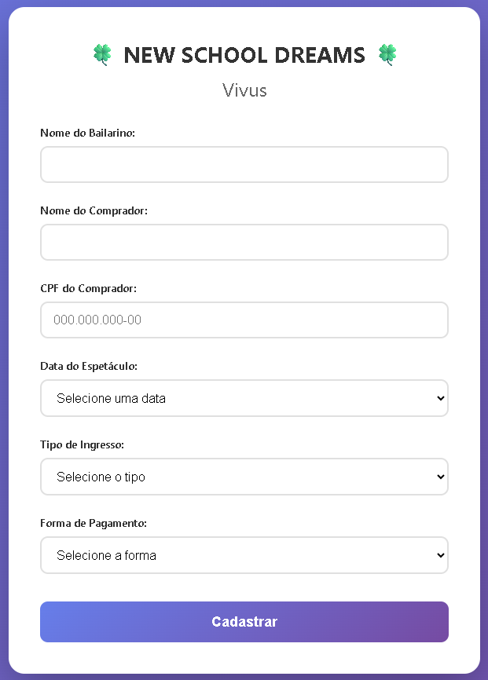

# [Fórmulário de Venda de Ingresso]

Projeto para cadastrar os ingressos que eram vendidos pelas bailarinas do grupo, construído como parte dos meus estudos de desenvolvimento Full Stack.

**[https://vivusnsd.netlify.app/]** 👈

---

### 🚀 Tecnologias Utilizadas

* 
* 
* 
* 
* 

---

### 📷 Screenshots

